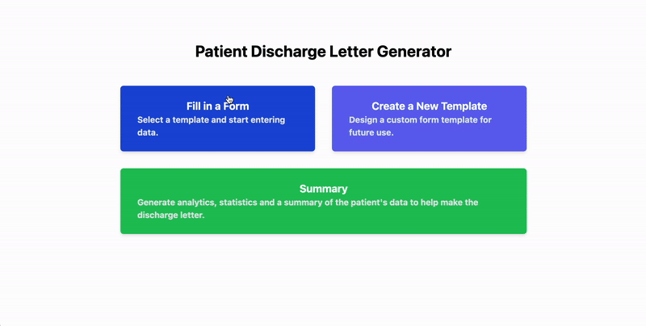

# FHIR Hackathon: Streamlining the Discharge Process

This project is a web application that aims to streamline the discharge process for patients.

## What does it do?

## Template Creation

The application allows doctors to create different forms for patients depending on the type of test they are taking. The doctor can then use that form as a template for future patients, making the process more efficient.

<p align="center">
  
</p>

The doctor can also modify existing form templates to make more specific forms for patients.

## Patient Checkup

The application allows doctors to fill out forms for patients. The forms are automatically saved to the patient's in a cloud database (firebase) so that the doctor can later generate a draft summary of the entire patient's checkup data.

<p align="center">
  
</p>

## Patient Summary

The application allows doctors to generate a draft summary with various graphs and patient statistics. The doctor can then use this summary as a reference to speed up the making of the final patient discharge letter.

<p align="center">
  
</p>

## Testing the project locally

First, clone the repository:

```bash
git clone https://github.com/OminousSquash/FHIRHackathon.git
```

Then, navigate to the project directory:

```bash
cd FHIRHackathon
```

Make sure you have [Node.js](https://nodejs.org/en/) installed.


If you haven't installed vite yet, run the following command:

```bash
npm create vite@latest
```

Then, install the dependencies:

```bash
npm install
```

Finally, run the project:

```bash
npm run dev
```
